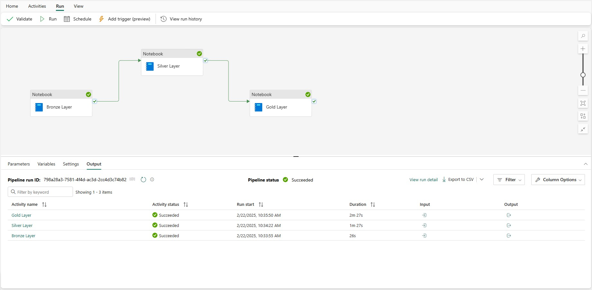

# End-to-End Microsoft Fabric Data Engineering Project

## Overview

This project demonstrates an end-to-end data engineering solution built with Microsoft Fabric. Earthquake event data is extracted from the USGS API, processed through a Medallion Architecture (Bronze, Silver, and Gold), and transformed into analytics-ready datasets for reporting in Power BI.

The project showcases the complete data engineering lifecycle, including API integration, ETL pipeline development, data transformation with PySpark, Lakehouse implementation, and interactive business intelligence reporting.

---

## Project Architecture

The solution follows a Medallion Architecture to ensure scalable and reliable data processing.

### Bronze Layer
- Ingests raw earthquake data from the USGS REST API.
- Stores the original JSON files in the Lakehouse.
- Preserves source data for auditing and future processing.

### Silver Layer
- Cleans and validates raw data.
- Handles missing values and inconsistent records.
- Transforms JSON into structured tables using PySpark.

### Gold Layer
- Creates business-ready datasets.
- Optimizes data for reporting and analytics.
- Serves as the data source for Power BI.

---

## Technology Stack

| Technology | Purpose |
|------------|---------|
| Microsoft Fabric | Data Engineering Platform |
| Data Factory | Pipeline Orchestration |
| Lakehouse | Data Storage |
| OneLake | Centralized Storage |
| Python | API Integration |
| PySpark | Data Transformation |
| Power BI | Reporting & Dashboards |
| REST API | Data Source |

---

## ETL Pipeline

The data pipeline is orchestrated using Microsoft Fabric Data Factory.

The workflow automatically:

- Extracts earthquake data from the USGS API
- Loads raw data into the Bronze Layer
- Executes PySpark notebooks for data transformation
- Creates curated datasets in the Gold Layer
- Makes the data available for Power BI reporting

---

## Power BI Dashboard

The dashboard provides interactive insights into earthquake activity, including:

- Earthquake magnitude trends
- Geographic distribution
- Event locations
- Time-based analysis
- Interactive filtering
- Business-ready KPIs

---

## Key Features

- End-to-end Microsoft Fabric solution
- REST API integration
- Automated ETL pipeline
- Medallion Architecture
- Lakehouse implementation
- PySpark data transformation
- Interactive Power BI dashboard
- Enterprise-ready data engineering workflow

---

## Business Value

This project demonstrates how Microsoft Fabric can be used to build a modern cloud-based data platform that transforms raw API data into reliable, analytics-ready datasets. The solution follows industry-standard data engineering practices and provides a scalable foundation for reporting and decision-making.

---

## About This Project

This repository is part of my Microsoft Fabric and Data Engineering portfolio. It demonstrates practical experience in building end-to-end ETL pipelines, implementing Lakehouse architecture, transforming data with PySpark, and creating Power BI dashboards for business analytics.
